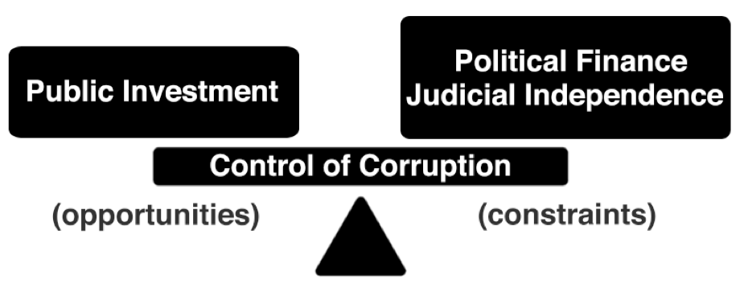
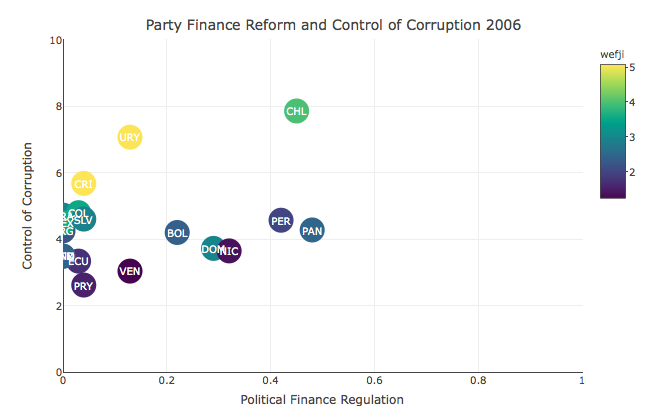
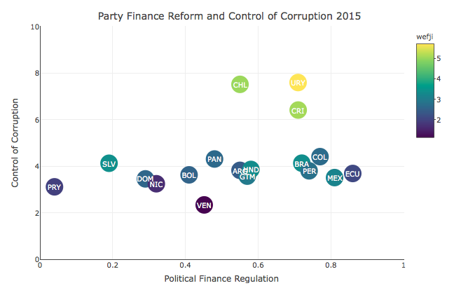
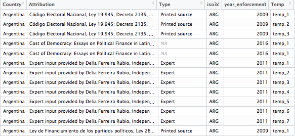
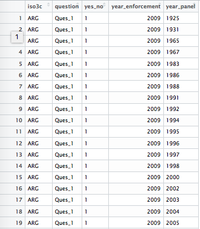
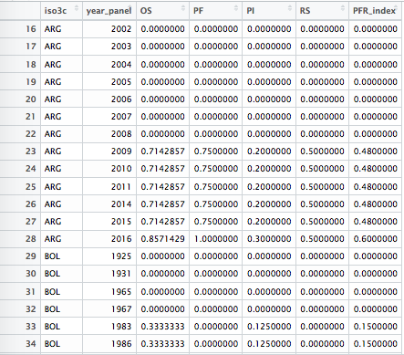

\pagebreak

```{r setup, include=FALSE}
knitr::opts_chunk$set(echo = FALSE, warning = FALSE, message = FALSE,
  error = FALSE, cache = 2, fig.pos = "h", fig.align = "center",
  fig.width = 6, fig.height = 3)
knitr::opts_knit$set(root.dir = "/Users/alvarolopezguiresse/OneDrive/Documents/[0.2] Data Management in R/MPPThesis2017")


```

```{r wd, eval=TRUE}

library(dplyr)
library(plotly)
library(rworldmap)
library(zoo)
library(margins)
library(interplot)


```

<!-- Title page styling -->
\pagenumbering{roman}
\thispagestyle{empty}
\begin{centering}

\vspace{4 cm}

\Huge

{\bf Final Assigment \\ \Large from Excel to R}

\vspace{1 cm}
{\color{gray} \line(1, 0){250}}
\vspace{2 cm}

\Large
Alvaro Lopez

\normalsize
Master of Public Policy

Class of 2017

\vspace{2 cm}

April 2017

\vspace{3 cm}

\normalsize
\includegraphics[width=.23  \textwidth]{templates/logo.png}

\href{https://www.hertie-school.org/en/}{Hertie School of Governance} 

\end{centering}

\clearpage

\newpage
\thispagestyle{empty}
\vspace{4 cm}
\small


\normalsize
\clearpage
\newpage
\setcounter{page}{1}


\newpage

# Introduction {#intro}

The aim of this assignment is to reproduce the data-management work performed for the MPP master thesis., initially performed in Excel. 

The First section describes the data-management work done using R in order to build a Political Finance Regulation Index, using the IDEA Political Finance Survey. 

In the second section, once calculated, this Index was merged with several governance variables in order to run a regression analysis for Latin America.

In the final section, the plots and regression analysis are reproduced using R.

The text in the following document is a transcription of the master thesis work, given the aim of this project was reproducing the main results in R.


\newpage
<!-- \% Table of Contents Styling -->
\thispagestyle{empty}
\tableofcontents
\clearpage
\pagebreak

\pagenumbering{arabic}

# Methodology {#method}

Our aim is to study the relation between control of corruption (the dependent variable) and political finance regulation (the independent variable). Following a multivariate model and based on the equilibrium model by Mungiu-Pippidi (2015) we seek to analyse other independent variables such as public investment and judicial independence, considered an opportunity and a constraint of control of corruption, respectively. Figure I shows a graphical representation of this model. 




To measure the variations of the dependent variable control of corruption between countries and across time, we decided to use the index developed by the World Bank for their World Governance Indicators (WGI). The Control of Corruption (CoC) Indicator of the WGI measures the extent to which public power is exercised for private gain, including both petty and grand forms of corruption, as well as capture of the state by elites and private interests.??? (Kaufmann et al., 2010, p. 4). The original indicator has a scale of -2.5-2.5 but it was rescaled to 0-10 to avoid negative numbers. With the new scale, 0 is a country with no control of corruption and 10 is a country with the highest control of corruption. The WGI has information about more than 200 countries and goes as far back as 1996. 

In the same sense, there was a need for reliable data to analyse one of the independent variables: political finance regulation. We used the IDEA Political Finance Database to develop a Political Finance Regulation (PFR) Index. IDEA includes more than 180 countries and excludes cases where no elections have been held in the previous 30 years, as well as where political parties are not allowed to exist or register candidates.

IDEAs Political Finance dataset is comprised of 43 questions, which reflect each country's legislation in the matter. The database has a high response rate, with around 7000 answers from more than 1000 sources. In addition, the dataset provides the exact source and year when the law was enacted on its appendix. 

The responses of the IDEA questionnaire are useful to build a cross-sectional index, but the supplementary information of the legal sources and documents provides an opportunity to trace changes in the legislation through the years. With both sources of information, we built a panel dataset that spans from 1996 to 2015. 

Specifically, every YES response in the IDEA questionnaire was coded with a 1 and every NO with a value of 0. Additionally, a value of 0 was coded for every previous year of the date that the law in the matter was enacted, and a value of 1 since that year onwards. It is worth mentioning that every question taken into account for building the Index was weighted equally. Also, factor analysis was made to test a different possible weighting criteria. The correlation between the equal weighted index and the factor analysis was high. 

To build the PFR Index, we considered only YES-NO questions. Because of this, only 31 questions of the questionnaire where taken into account. In the case of categorical questions (with different options for a YES response), the detail of the response was ignored and only filled with a YES. Qualitative questions in the survey were not taken into account. Moreover, the answers were divided in the four categories of the database:

Bans and limits on private income (BLPI), questions 1 to 18. 
Public funding (PF), questions 19 to 28.
Regulation of spending (RS), questions 29 to 34.
Reporting oversight and sanctions (OS), questions 35 to 43.

Following IDEAs criteria, the few cases with sources of judicial decisions were also taken into account. Additionally, if a question had legislative sources from different years, the oldest date is considered as the year the law was enacted. This has the objective of avoiding favouring specific legislation and to provide methodological simplicity. In this respect, our indicator was more sensible to older legislation in questions with multiple sources.  Moreover, in questions with only one source that was updated on a subsequent year, the index takes into account only the most recent update. Methodologically, this seeks to provide certainty about the moment when the requirements of that particular question count as an affirmative answer. This makes the questions with updated sources more sensible to the most recent regulation. 

The PFR Index is useful for a descriptive analysis of the worlds legislative efforts of party finance. Also, it provides panel data to do an inferential statistical analysis of our region of interest, Latin America, with a model that includes other relevant variables like life expectancy or percentage of rural population.  

For our other independent variable and based on the equilibrium model, we used data from capital expenditures of Latin American countries available from the Economic Commission for Latin America and the Caribbean (ECLAC), a United Nations regional commission to encourage economic cooperation. This information is provided as a percentage of GDP of the 20 countries of Latin America. The information as a percentage does not capture the increase in real terms of these kinds of expenditures, given the economic growth of the region during this time. Taking this into account, we multiplied it with information about GDP in US dollars provided by the World Bank. The ECLAC provides information on capital expenditure as far back as 2003. Nevertheless, we only used data from 2006 to 2015 given the limitation on another relevant variable for our model, judicial independence. 

In this study, we also work with a variable developed by the World Economic Forum (WEF), which measures the independence of the judiciary from influences of the government, individuals, or companies. (WEF, 2016) This indicator has a scale of 0 to 7, with countries with lower scores having less judicial independence than countries with higher scores. This data extends between 2006 and 2015, so a panel data analysis including this variable would only account for ten yearly observations for each country. It is worth mentioning that the WEF Judicial Independence Index excludes Cuba and includes only five years of observations for Haiti, so our analysis for Latin America excludes both countries and only takes into account the remaining members of the ECLAC. Including all of these variables results in an analysis of 18 countries across ten years, or in other words, 180 observations.  

The gathered information allows performing a panel data analysis, taking into account differences between countries as well as changes over time. We chose to study Latin America because most of its countries have enacted political finance regulation in the recent years but are still fighting to increase its levels of control of corruption. Also, all of the countries in the region are constitutional democracies and have a common colonial past. 
 

# Results

This section includes the results of a descriptive and inferential statistical analysis of the variables previously mentioned. All of the figures are based on our calculations and using the aforementioned databases.

## The State of Political Finance Regulation in the World

The results show an overall incidence of Political Finance Regulation in most of the countries in the world and a growing trend of efforts in the matter over the last 20 years. Figure 2 shows the levels of the PFR Index in 2015. Countries in lighter shades of yellow have lower levels of regulation; inversely, countries in darker red shades have higher ones. In the map one can see clearly the high levels of regulation in Latin America, low levels in Africa and a mixed scenario in Europe and Asia, considering that there is no data in countries like China and Saudi Arabia. 
\pagebreak


```{r figure_ii, fig.cap="Worldwide PFR Index, 2015"}

df <- read.csv("3) FIGURES & ANALYSiS/figure_ii_vi.csv")

n1 <- joinCountryData2Map(df, joinCode="ISO3", nameJoinColumn= "iso3c")
map1 <- mapCountryData(n1, nameColumnToPlot = "idea_pct", mapTitle = "PFR Index 2015", colourPalette = "heat", catMethod = "pretty")

```


The yearly increase of regulation is evident in Figure 3 which shows the changes over time of the PFR Index. This figure displays an increasing trend in the regulation effort in all regions. The slope remains positive for the period 1996-2005, increasing its steepness after 2006. Europe is the region that increased its party finance regulation the most, implementing 55% of regulations, with notable growth after 2010. The Americas and Asia occupy the second and third places respectively in terms of adoption of regulations. 
\pagebreak


```{r figure_iii, fig.cap="Worldwide PFR Index, 2015"}

df <- read.csv("3) FIGURES & ANALYSiS/figure_iii.csv")

df <- df %>% 
  dplyr::rename(Region = un_region_name)

p <- ggplot(df, aes(x = year_panel, y = pfr, color = Region)) +
  geom_line() +
  ggtitle("Worldwide PFR Index, 2015") +
  labs(x = "year", y = "PFR.Index") +
  theme(plot.background = element_rect(size=0.5,linetype="solid",color="black"))
p


```


The increase of Party Finance Regulation has not been reflected in control of corruption. Figure 4 displays the increasing trend of the PFR Index but also shows that the average of the CoC Indicator has stagnated and even displays a slight downward trajectory. The evolution of both suggests that the political finance regulation efforts made by different countries are not associated with an overall improvement in the control of corruption.
\pagebreak


```{r figure_iv, fig.cap="PFR Index and CoC Indicator time series, 1996-2015"}

df <- read.csv("3) FIGURES & ANALYSiS/figure_iv.csv")

p <- ggplot(df, aes(x = year_panel)) + 
  geom_line(aes(y = pfr)) +
  geom_line(aes(y = (coc-4.8) * (0.5/0.2)), colour = "red") + 
  scale_y_continuous(sec.axis = sec_axis(~ . * 0.2/0.5 + 4.8, name = "CoC")) +
  ggtitle("PFR Index and CoC Indicator time series, 1996-2015") +
  labs(x = "year", y = "PFR.Index") +
  theme(plot.background = element_rect(size=0.5,linetype="solid",color="black"))
p


```


The overall increase in the PFR Index is reflected in all the categories of the database, although there are some small differences to note. Figure 5 shows that the regulation area that has increased the most in relative terms in all regions is oversight and sanctions, while the public funding has been the least regulated issue. Nonetheless, the figure displays that all the sub-indexes have increased systematically since 1996. This reflects a widespread trend around the world to increase Party Finance Regulation in a comprehensive manner, including regulations across the whole spectrum. 
\pagebreak


```{r figure_v, fig.cap="PFR Sub-Index Level by region, 1996 and 2015. BLPI: Bans and limits on private income, PF: Public funding, RS: Regulation on spending, OS: Oversight and sanctions"}

df <- read.csv("3) FIGURES & ANALYSiS/figure_v.csv")

df$year_panel <- df$year_panel %>% 
  as.character()

df$index_type <- df$index_type %>% 
  as.character()
  
df <- df %>% 
  rename(PFR.Index = pfr, year = year_panel, Sub.Index = index_type) %>% 
  mutate(Sub.Index = ifelse(Sub.Index == "blpi_pct", "PI",Sub.Index)) %>% 
  mutate(Sub.Index = ifelse(Sub.Index == "os_pct", "OS",Sub.Index)) %>% 
  mutate(Sub.Index = ifelse(Sub.Index == "pf_pct", "PF",Sub.Index)) %>% 
  mutate(Sub.Index = ifelse(Sub.Index == "rs_pct", "RS",Sub.Index))

p <- ggplot(df) +
  geom_col(aes(x = year, y = PFR.Index, fill = Sub.Index), position = "dodge") +
  facet_grid(. ~ un_region_name) +
  ggtitle("PFR Sub-Index Level by region, 1996 and 2015") +
  theme(plot.background = element_rect(size=0.5,linetype="solid",color="black"))
  

p

```


##	Political Finance Regulation and Control of Corruption in Latin America

The worldwide increase in the PFR Index is also reflected in the Latin American region. Figure 6 shows that most countries have a medium or a high degree of PFR. However, there are exceptions like Bolivia, Venezuela and Paraguay, which show low levels in the PFR Index. 
\pagebreak


```{r figure_vi, fig.cap="PFR Index Latin America, 2015"}

df <- read.csv("3) FIGURES & ANALYSiS/figure_ii_vi.csv")

n2 <- joinCountryData2Map(df, joinCode="ISO3", nameJoinColumn="iso3c")
map2 <- mapCountryData(n2, nameColumnToPlot="idea_pct", mapTitle="PFR Index Latin America 2015",mapRegion="latin america", colourPalette = "heat") 


```


Following the worldwide trend, Figure 7 shows the evolution for the PFR Index and its subcomponents for Latin America. The regulation category that increased the most is oversight and sanctions. In second place appears regulation on spending, followed by bans and limits on private income and public funding.
\pagebreak


```{r figure_vii, fig.cap="PFR Sub-index Time Series in Latin America, 1996 to 2015. BLPI: Bans and limits on private income, PF: Public funding, RS: Regulation on spending, OS: Oversight and sanctions"}

df <- read.csv("3) FIGURES & ANALYSiS/figure_vii.csv")

df$index_type <- df$index_type %>% 
  as.character()

df <- df %>% 
  rename(PFR.Index = pfr, year = year_panel, Sub.Index = index_type) %>% 
  mutate(Sub.Index = ifelse(Sub.Index == "blpi_pct", "PI",Sub.Index)) %>% 
  mutate(Sub.Index = ifelse(Sub.Index == "os_pct", "OS",Sub.Index)) %>% 
  mutate(Sub.Index = ifelse(Sub.Index == "pf_pct", "PF",Sub.Index)) %>% 
  mutate(Sub.Index = ifelse(Sub.Index == "rs_pct", "RS",Sub.Index)) %>% 
  mutate(Sub.Index = ifelse(Sub.Index == "idea_pct", "PFR.Index",Sub.Index)) %>% 
  filter(!Sub.Index == "PFR.Index")


p <- ggplot(df, aes(x = year, y = PFR.Index, color = Sub.Index )) +
  geom_line() +
  ggtitle("PFR Sub.Index Time Series in Latin America") +
  theme(plot.background = element_rect(size=0.5,linetype="solid",color="black"))
  
p


```


Moreover, Figure 8 shows the levels of the PFR Index in 2006 and 2015 for Latin American countries. Results indicate that Ecuador is the country with the biggest increase in party finance regulation, followed by Mexico and Colombia. Contrarily, Paraguay and Dominican Republic show no change.
\pagebreak


```{r figure_viii, fig.cap="PFR Index Level in Latin America, 2006 and 2015"}

df <- read.csv("3) FIGURES & ANALYSiS/figure_viii.csv")

df$year_panel <- df$year_panel %>% 
  as.factor() 

df <- df %>% 
  rename(year = year_panel, PFR.Index = pfr, country = iso3c)


p <- ggplot(df) +
  geom_col(aes(x = country, y = PFR.Index, fill = year), position = "dodge") +
  ggtitle("PFR Index Level in Latin America, 2006 and 2015") +
  theme(plot.background = element_rect(size=0.5,linetype="solid",color="black"))

p

```

As with the rest of the world, in Latin America an increase in the PFR Index is not reflected on the CoC Indicator. Figure 9 shows the average change in the level of political finance regulation for the region and the average change of the CoC Indicator from 1996 to 2015. The Figure also shows that while the CoC Indicator slightly improves for the period 1996-2010 in Latin America, this is reversed after year 2011 with a strong deterioration of the levels of corruption.
\pagebreak


```{r figure_ix, fig.cap="Mean PFR Index and CoC Indicator series in Latin America, 2006-2015"}

df <- read.csv("3) FIGURES & ANALYSiS/figure_ix.csv")

df <- df %>% 
  rename(PFR.Index = pfr)

p <- ggplot(df, aes(x = year_panel)) + 
  geom_line(aes(y = PFR.Index)) +
  geom_line(aes(y = (coc-4) * (0.55/1)), colour = "red") + 
  scale_y_continuous(sec.axis = sec_axis(~ . * 1/0.55 + 4, name = "CoC")) +
  ggtitle("Mean PFR.Index and CoC Latin America") +
  theme(plot.background = element_rect(size=0.5,linetype="solid",color="black")) +
  labs(x = "year")
p


```


The data shows that countries that increased their regulation the most between 2006 and 2015 are Ecuador, Mexico and Colombia, which is represented in Figure 10. This suggests that increases in legislation are not always correlated with a reduction in the control of corruption. Ecuador seems to be the exception by showing an improvement in its control of corruption. In addition, Guatemala, Honduras and Uruguay have also shown improvements in the last decade. 
\pagebreak


```{r figure_x, fig.cap="PFR Index and World Bank Control of Corruption Change in Latin America, 2006-2015"}

df <- read.csv("3) FIGURES & ANALYSiS/figure_x.csv")

df <- df %>% 
  mutate(key = ifelse(key == "coc_diff", "CoC", "PFR.Index"))


p <- ggplot(df) +
  geom_col(aes(x = reorder(iso3c, value), y = value, fill = key), position = "dodge") +
  ggtitle("PFR.Index and CoC change in Latin America") +
  theme(plot.background = element_rect(size=0.5,linetype="solid",color="black")) +
  labs(x = "country", y = "Change 2006-2015") +
   theme(legend.title=element_blank())
p

```

The WEF Judicial Independence Indicator, as illustrated in Figure 10, complements the relation between control of corruption and political finance regulation. Among all Latin American countries, there are three achievers in terms of control of corruption: Chile, Uruguay and Costa Rica. As seen in Figures 11 and 12, these countries also have the highest score of judicial independence. Within this group, Uruguay and Costa Rica made a significant amount of efforts regarding political finance regulation from 2006 to 2015, while Chiles Index did not rise at their pace. Also, Uruguay and Costa Rica improved their CoC Indicator, while Chile??s worsened. This suggests that in countries with high levels of judicial independence, higher political finance regulation leads to an increase of control of corruption.  
\pagebreak



\pagebreak




```{r figure_xi, fig.cap="CoC Indicator, PFR Index and WEF Judicial Independence, 2006", fig.height = 4, eval=F}


df2006 <- read.csv("3) FIGURES & ANALYSiS/figure_xi.csv")

p2006 <- plot_ly(df2006, x = ~idea_pct, y = ~CoC_recoded, color = ~wefji, marker = list(size = 30),
                 text= ~iso3c, type='scatter', mode= 'markers', title="Effect of Political Finance Regulation on Control of Corruption 2006") %>% 
  add_annotations(x = df2006$idea_pct,
                  y = df2006$CoC_recoded,
                  text = rownames(df2006$iso3c),
                  xref = "x",
                  yref = "y",
                  showarrow = F,
                  font = list(color = 'white'),
                  arrowhead = 4,
                  arrowsize = .5,
                  ax = 20,
                  ay = -40) %>% 
  layout(title ='Party Finance Reform and Control of Corruption 2006', 
         xaxis = list(title='Political Finance Regulation', range = c(0, 1)), 
         yaxis = list(title='Control of Corruption', range = c(0, 10)), autosize = T)

```


```{r figure_xii, fig.cap="CoC Indicator, PFR Index and WEF Judicial Independence, 2006", fig.height = 4, eval=F}


df2015 <- read.csv("3) FIGURES & ANALYSiS/figure_xii.csv")

p <- plot_ly(df2015, x = ~idea_pct, y = ~CoC_recoded, color = ~wefji, marker = list(size = 30),
             text= ~iso3c, type='scatter', mode= 'markers', 
             title="Effect of Political Finance Regulation on Control of Corruption 2006") %>% 
  add_annotations(x = df2015$idea_pct,
                  y = df2015$CoC_recoded,
                  text = rownames(df2015$iso3c),
                  font = list(color = 'white'),
                  xref = "x",
                  yref = "y",
                  showarrow = F,
                  ax = 20,
                  ay = -40) %>%
  layout(title ='Party Finance Reform and Control of Corruption 2015', 
         xaxis = list(title='Political Finance Regulation', range = c(0, 1)), 
         yaxis = list(title='Control of Corruption', range = c(0, 10)), autosize = T)


```

\pagebreak

## Panel Regression Model of Latin America

To further explore the relationship between control of corruption, political finance regulation and judicial independence, inferential statistics are necessary, allowing to further include other variables like public investment, as well as control for level of development. This model includes 18 countries of Latin America from 2006 to 2015. 

### Variable Description
As explained in the methodology chapter, the dependent variable is control of corruption, while the independent variables are political finance regulation, public investment and judicial independence, using the previously mentioned indicators. The regression model will intentionally resemble the equilibrium model described in the theoretical section of this study. In addition, life expectancy and the percentage of rural population and are included as control variables for level of development.

### Multivariate Regression Model 

To better reflect the equilibrium model, a multivariate regression is needed. The multivariate regression model is estimated in equations 1 to 9. Results for pooled OLS, fixed effects (FE) and random effects (RE) are presented. Several results are offered to assess the robustness of the analysis. 

\begin{equation}
\ CoC_{it} = \beta_{0} +  \beta_{1} PFR_{it} + \beta_{2} PI_{it} + \beta_{3} JI_{it} + \beta{4} JI_{it} PFR_{it} + \beta{5} JI_{it} PI_{it} + RP_{it} + LE_{it} +\epsilon_{it}
\end{equation}


The tables show that increases in political finance regulation are related with a deterioration of control of corruption in Latin America. This relationship is statistically significant in the panel estimations. Inversely, the negative relationship between regulation and control of corruption becomes positive in countries with high levels of judicial independence. Furthermore, for countries with high levels of judicial independence, an increase in political finance regulation has a positive effect on control of corruption.

\pagebreak

```{r ols_i, echo = FALSE, results="asis"}

idea_excel <- read.csv("3) FIGURES & ANALYSiS/database_old_excel.csv")
idea_R <- read.csv("3) FIGURES & ANALYSiS/database.csv")

# latin american sample
countries <- c("ARG", "BOL", "BRA", "CHL", "COL", "CRI", "DOM", "ECU", "GTM", 
               "HND", "MEX", "NIC", "PAN", "PER", "PRY", "SLV", "URY", "VEN")

idea_excel <- idea_excel %>% 
  dplyr::rename(iso3c = Ticker, year_panel = Year) %>% 
  dplyr::select(iso3c, year_panel, blpi_pct, pf_pct, rs_pct, os_pct, idea_pct, CoC, un_region_name)

idea_excel <- idea_excel %>% 
  group_by(iso3c) %>% 
  mutate(CoC_01 = na.locf(CoC, na.rm = F))

idea_excel <- idea_excel %>%  
  filter(!iso3c == "TWN")
  
# sample latin america
idea_excel <- idea_excel %>% 
  filter(iso3c %in% countries) %>% 
  filter(year_panel >= 2006 & year_panel <= 2015)
  
data <- full_join(idea_excel, idea_R, by = c("iso3c", "year_panel"))

# results recalculated
df <- data %>% 
  dplyr::select(iso3c, year_panel, CoC, CoC_01, PFR_index, wefji, p_expenditure, ruralpop, lifeexpectancy)

df <- df %>% 
  rename(idea_pct = PFR_index)

# Table.
m16 <- lm(CoC ~ iso3c + idea_pct + wefji + p_expenditure + wefji:idea_pct + wefji:p_expenditure + lifeexpectancy + ruralpop, data = df)


m17 <- plm(CoC ~ idea_pct + wefji + p_expenditure + wefji:idea_pct + wefji:p_expenditure + lifeexpectancy + ruralpop, data = df, index= c("iso3c", "year_panel"), model = "within")

m18 <- plm(CoC ~ idea_pct + wefji + p_expenditure + wefji:idea_pct + wefji:p_expenditure + lifeexpectancy + ruralpop, data = df, index= c("iso3c", "year_panel"), model = "random")


stargazer(m17, m18,
          header = FALSE, float = TRUE,
          report = ('vc*p'),
          title            = "Panel Regression",
          covariate.labels = c("PFR", "JI", "PE", "PFR*JI", "PFR*PE", "LE", "RP"),
          dep.var.caption = "Control of Corruption",
          dep.var.labels.include = FALSE,
          column.labels = c("Random Effects", "Fixed Effects"),
          type = "latex"
)


```


The marginal effects plot in Figure 13 illustrates this relationship, showing how different levels of the PFR Index and judicial independence interact with control of corruption, and it uses the following equation:

\begin{equation}
\ frac{\partial CoC_{it}}{\partial PFR_{it}} =  \beta_{1} + \beta{4} JI_{it}
\end{equation}

In brief, efforts in terms of political finance regulation are effective only in countries with high judicial independence. As Figure XIII shows, the marginal effect of passing new political finance legislation is significant when both judicial independence and the PFR Index are high. Conversely, in countries with low levels of judicial independence, adding rules to the realm of political finance is self-defeating, since control of corruption keeps deteriorating. 

```{r figure_xiii, fig.cap = "Marginal effect of Political Finance Regulation"}

idea_excel <- read.csv("3) FIGURES & ANALYSiS/database_old_excel.csv")
idea_R <- read.csv("3) FIGURES & ANALYSiS/database.csv")

# latin american sample
countries <- c("ARG", "BOL", "BRA", "CHL", "COL", "CRI", "DOM", "ECU", "GTM", 
               "HND", "MEX", "NIC", "PAN", "PER", "PRY", "SLV", "URY", "VEN")

idea_excel <- idea_excel %>% 
  dplyr::rename(iso3c = Ticker, year_panel = Year) %>% 
  dplyr::select(iso3c, year_panel, blpi_pct, pf_pct, rs_pct, os_pct, idea_pct, CoC, un_region_name)

idea_excel <- idea_excel %>% 
  group_by(iso3c) %>% 
  mutate(CoC_01 = na.locf(CoC, na.rm = F))

idea_excel <- idea_excel %>%  
  filter(!iso3c == "TWN")
  
# sample latin america
idea_excel <- idea_excel %>% 
  filter(iso3c %in% countries) %>% 
  filter(year_panel >= 2006 & year_panel <= 2015)
  
data <- full_join(idea_excel, idea_R, by = c("iso3c", "year_panel"))

# results recalculated
df <- data %>% 
  dplyr::select(iso3c, year_panel, CoC, CoC_01, PFR_index, wefji, p_expenditure, ruralpop, lifeexpectancy)

df <- df %>% 
  rename(idea_pct = PFR_index)

# Table.
m16 <- lm(CoC ~ iso3c + idea_pct + wefji + p_expenditure + wefji:idea_pct + wefji:p_expenditure + lifeexpectancy + ruralpop, data = df)

m17 <- plm(CoC ~ idea_pct + wefji + p_expenditure + wefji:idea_pct + wefji:p_expenditure + lifeexpectancy + ruralpop, data = df, index= c("iso3c", "year_panel"), model = "within")

m18 <- plm(CoC ~ idea_pct + wefji + p_expenditure + wefji:idea_pct + wefji:p_expenditure + lifeexpectancy + ruralpop, data = df, index= c("iso3c", "year_panel"), model = "random")

interplot(m = m16, var1 = "idea_pct", var2 = "wefji", hist = TRUE) + 
  geom_hline(yintercept = 0, linetype = "dashed") +
  aes(color = "pink") + theme(legend.position="none")


```


# Conclusions
The main results of the quantitative analysis show that there is a significant worldwide increase in the levels of political finance regulation. This trend was also perceived in Latin America. Furthermore, our statistical model shows that increases in political finance regulation are related with a deterioration of control of corruption. This relationship is statistically significant in the panel estimations. Inversely, the negative relationship between political finance regulation and control of corruption turns out to be positive in countries with high levels of judicial independence. In short, for countries with high levels of judicial independence, an increase in regulation has a positive effect on control of corruption. In the same sense, increases in opportunities to corrupt, represented by levels of public investment, have a significant and negative effect in control of corruption in countries with lower levels of judicial independence. 

# Data Management Description {#datamanagement}

## 1) PFR_index
In this folder is done the datamanagement

### 1_appendix.R

The IDEA appendix has all of the sources (laws) that were used in order to answer the survey. The year on which every law was enacted is extracted. Thus, after running this code, a dataset for every country, is obtained, on which all of the legal sources are coded with their respective years. "Attribution"" is the legal source, "year_enforcement" i the year on which the law was enforced, and "Temp" each value temp_i is the question on which the legal source was used for every year (Question and question_i makes more sense though...). The output of this script is "output_IDEA_appendix.csv".



### 2_PFRI_panel.R
This script builds the following panel dataset, using "output_IDEA_appendix.csv". "year_panel" is the time dimension of the panel,which spans from 1925 to 2016. Every country "iso3c", has its set of "questions" Ques_i, for every question the "year_enforcement" is coded, as well as if a "yes_no" answer was given. 



### 3_PFRI_index_calculation.R
This script takes the file "output_PFR_Index_database.csv" and calculates the Political Finance regulation Index for every country using the methodology described above. Thus, takes the simple average for every question for every country across time. Results are in "output_panel_pfr_index.csv". PFR_Index is the Political finance regulation Index, and the other variables are its sub components.



## 2) DATABASE
The dataset above is merged with the variables used in the model.

## 3) FIGURES & ANALYSiS
The datamanagement for figures is done.


